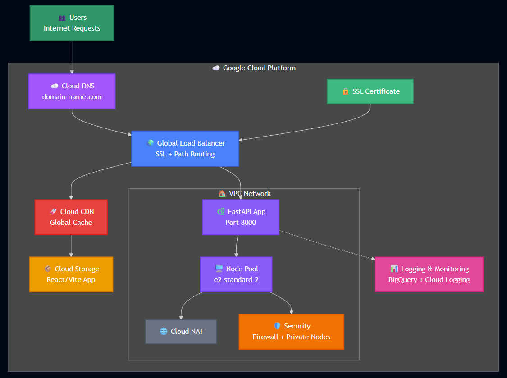

# Portfolio Website Infrastructure

[](https://www.terraform.io/)
[](https://cloud.google.com/)
[](LICENSE)
[](https://kubernetes.io/)
[](https://fastapi.tiangolo.com/)
[](https://reactjs.org/)
[](https://github.com/Portfolio-Website-DarylCFerns99/portfolio-website-infrastructure/graphs/commit-activity)
[](http://makeapullrequest.com)

A comprehensive Terraform configuration for deploying a modern, production-ready portfolio website on Google Cloud Platform. This infrastructure supports a full-stack web application with a React/Vite frontend served via Cloud CDN and a FastAPI backend running on Google Kubernetes Engine.

## 🏗️ Architecture Overview



This infrastructure provides:

- **Frontend**: Static React/Vite application served from Google Cloud Storage with Cloud CDN
- **Backend**: FastAPI application running on Google Kubernetes Engine (GKE)
- **Load Balancer**: Path-based routing serving both components on a single domain
- **Security**: HTTPS with SSL certificates, private GKE nodes, and configurable firewall rules
- **Monitoring**: Comprehensive logging and monitoring across all components
- **DNS Management**: Automated DNS record management with Cloud DNS
- **CI/CD Ready**: GitHub Actions support for automated deployments

## ✨ Key Features

### Infrastructure as Code
- Complete infrastructure definition using Terraform
- Automated GCP API enablement
- Remote state management with Cloud Storage backend
- Environment-specific configurations

### Security & Compliance
- Private GKE cluster with restricted node access
- SSL/TLS termination with custom certificates
- Network-level security with VPC and firewall rules
- Optional egress traffic restrictions
- Workload Identity for secure pod-to-GCP API access
- Shielded GKE nodes for enhanced security

### Production-Ready Features
- Auto-scaling GKE node pools
- Cloud CDN for global content delivery
- Comprehensive logging pipeline to Cloud Logging and BigQuery
- Health checks and load balancing
- VPC Flow Logs for network monitoring
- Automatic HTTP to HTTPS redirects

### Developer Experience
- Helper scripts for streamlined deployment and cleanup
- Automated SSL certificate generation for testing
- Clear output information for post-deployment configuration
- CI/CD integration with GitHub Actions
- Detailed documentation and troubleshooting guides

## 📋 Prerequisites

Before you begin, ensure you have:

- **Google Cloud Platform account** with billing enabled
- **Terraform** (v1.0.0 or later) installed
- **Google Cloud SDK** (`gcloud`) installed and configured
- **SSL certificate and private key** for your domain
- **Docker image** for your FastAPI backend pushed to a container registry

## 🚀 Quick Start

### 1. Clone and Setup

```bash
git clone <your-repository-url>
cd portfolio-website-infrastructure
```

### 2. Configure Variables

```bash
cp terraform.tfvars.example terraform.tfvars
```

Edit `terraform.tfvars` with your specific values:

```hcl
# Essential Configuration
project_id   = "my-portfolio-project-123456"
project_name = "portfolio"
region       = "us-east1"
domain_name  = "your-domain.com"
api_container_image = "gcr.io/my-portfolio-project-123456/fastapi-app:latest"

# SSL Certificate Paths
ssl_private_key_path = "./private.key"
ssl_certificate_path = "./certificate.crt"

# GKE Configuration
gke_type               = "zone"  # or "region"
gke_instance_node_zone = "us-east1-b"  # Required when gke_type = "zone"
gke_machine_disk_size_gb = 15

# DNS Configuration (set to "" if using external DNS)
dns_zone_name = "your-domain-zone"
```

### 3. Deploy Using Helper Script (Recommended)

```bash
chmod +x deploy.sh
./deploy.sh
```

The deployment script will:
- Guide you through configuration if `terraform.tfvars` doesn't exist
- Generate self-signed SSL certificates for testing (if needed)
- Create a Terraform state bucket automatically
- Initialize Terraform with remote backend
- Plan and apply the infrastructure
- Display deployment outputs and next steps

### 4. Alternative: Manual Deployment

If you prefer manual control:

```bash
# Create Terraform state bucket
PROJECT_ID="my-portfolio-project-123456"
gsutil mb -l us-east1 gs://${PROJECT_ID}-tf-state
gsutil versioning set on gs://${PROJECT_ID}-tf-state

# Initialize Terraform
terraform init \
  -backend-config="bucket=${PROJECT_ID}-tf-state" \
  -backend-config="prefix=terraform/state"

# Plan and apply
terraform plan -out=tfplan
terraform apply tfplan
```

## 🌐 DNS Configuration

This infrastructure supports flexible DNS management:

### Option 1: Google Cloud DNS (Automated)
If you set `dns_zone_name` in your configuration:
- Root domain A record is created automatically
- All additional DNS records are managed via the `dns_records` map
- Update your domain's nameservers to Google's nameservers (shown in outputs)

### Option 2: External DNS Provider
If you set `dns_zone_name = ""`:
- Manually create an A record pointing your domain to the load balancer IP
- Manage additional DNS records through your DNS provider

### Adding DNS Records

Add records to the `dns_records` map in `terraform.tfvars`. The example below shows both SendGrid email service configuration and common website records:

```hcl
dns_records = {
  # SendGrid email configuration
  "em1234" = {
    record_type = "CNAME"
    ttl         = 3600
    records     = ["u12345678.wl123.sendgrid.net."]
    zone_name   = "your-domain-zone"
  },
  
  "s1._domainkey" = {
    record_type = "CNAME"
    ttl         = 3600
    records     = ["s1.domainkey.u12345678.wl123.sendgrid.net."]
    zone_name   = "your-domain-zone"
  },
  
  # Common DNS records
  "www" = {
    record_type = "CNAME"
    ttl         = 3600
    records     = ["your-domain.com."]
    zone_name   = "your-domain-zone"
  },
  
  "api" = {
    record_type = "CNAME"
    ttl         = 3600
    records     = ["your-domain.com."]
    zone_name   = "your-domain-zone"
  }
}
```

## 🔧 Configuration Reference

### Core Variables

| Variable | Description | Default | Required |
|----------|-------------|---------|----------|
| `project_id` | Your GCP project ID | - | ✅ |
| `project_name` | Resource naming prefix | `"vite-fastapi"` | ❌ |
| `region` | GCP region for resources | `"us-east1"` | ❌ |
| `domain_name` | Your domain name | - | ✅ |
| `api_container_image` | Backend container image | - | ✅ |

### SSL Configuration

| Variable | Description | Required |
|----------|-------------|----------|
| `ssl_private_key_path` | Path to SSL private key file | ✅ |
| `ssl_certificate_path` | Path to SSL certificate file | ✅ |

### GKE Configuration

| Variable | Description | Default |
|----------|-------------|---------|
| `gke_type` | Cluster type: "region" or "zone" | `"region"` |
| `gke_num_nodes` | Number of GKE nodes | `2` |
| `gke_machine_type` | GKE node machine type | `"e2-standard-2"` |
| `gke_machine_disk_size_gb` | Node disk size in GB | `10` |
| `gke_instance_node_zone` | GKE node zone (required for zonal clusters) | `"us-east1b"` |

### Networking Configuration

| Variable | Description | Default |
|----------|-------------|---------|
| `gke_subnet_cidr` | GKE subnet CIDR | `"10.0.0.0/20"` |
| `gke_pods_cidr` | GKE pods CIDR | `"10.16.0.0/14"` |
| `gke_services_cidr` | GKE services CIDR | `"10.20.0.0/20"` |
| `gke_master_cidr` | GKE master CIDR | `"172.16.0.0/28"` |

### Security Configuration

| Variable | Description | Default |
|----------|-------------|---------|
| `allowed_egress_domains` | Allowed outbound domains from GKE | `[]` |
| `allowed_egress_ip_ranges` | IP ranges for allowed domains | `[]` |

## 📤 Outputs

After successful deployment, you'll receive:

- **Load Balancer IP**: For DNS configuration
- **Frontend Bucket Name**: For uploading static assets
- **Kubernetes Cluster Info**: Connection details and credentials
- **URLs**: Frontend and API endpoints
- **DNS Configuration**: Instructions and record summaries
- **kubectl Command**: Ready-to-use cluster connection command

## 🛠️ Post-Deployment Steps

### 1. Configure DNS
- Point your domain to the load balancer IP (automatically handled if using Cloud DNS)
- Wait for DNS propagation (can take up to 48 hours)

### 2. Deploy Your Applications

#### Frontend Deployment
Upload your built React/Vite application to the Cloud Storage bucket:

```bash
# Build your frontend application
npm run build

# Upload to the bucket (replace with your bucket name from outputs)
gsutil -m rsync -r -d ./dist gs://your-frontend-bucket-name
```

#### Backend Deployment
Deploy your FastAPI application to GKE:

```bash
# Get cluster credentials
$(terraform output -raw kubectl_command)

# Apply your Kubernetes manifests
kubectl apply -f your-k8s-manifests/
```

### 3. Verify Deployment
- Check that your frontend loads at `https://your-domain.com`
- Verify API endpoints work at `https://your-domain.com/api`
- Monitor logs in the Google Cloud Console

## 🎭 SSL Certificate Management

### For Production
Use certificates from a trusted Certificate Authority or Let's Encrypt:

```bash
# Example with certbot (Let's Encrypt)
certbot certonly --manual --preferred-challenges dns -d your-domain.com
```

### For Testing
Generate self-signed certificates using the included script:

```bash
chmod +x generate-cert.sh
./generate-cert.sh your-domain.com
```

## 🔄 CI/CD Integration

This infrastructure supports GitHub Actions for automated deployments. See `GITHUB_SECRETS.md` for required secrets configuration.

Required GitHub Secrets:
- `GCP_PROJECT_ID`
- `GCP_SA_KEY` (base64-encoded service account key)
- `TF_STATE_BUCKET`
- `SSL_PRIVATE_KEY`
- `SSL_CERTIFICATE`

## 📊 Monitoring and Logging

### Built-in Logging
- **Application Logs**: GKE pod logs automatically sent to Cloud Logging
- **Infrastructure Logs**: Load balancer, CDN, and network logs
- **Security Logs**: Firewall and VPC flow logs
- **Storage**: Logs stored in dedicated Cloud Storage bucket and BigQuery

### Accessing Logs
```bash
# View GKE application logs
kubectl logs -f deployment/your-api-deployment -n your-namespace

# View infrastructure logs in Cloud Console
# Navigation: Cloud Console > Logging > Logs Explorer
```

### Monitoring Dashboards
Access pre-configured monitoring in the Google Cloud Console:
- GKE cluster metrics and health
- Load balancer performance
- CDN cache hit rates
- Resource utilization

## 🧹 Cleanup

### Using the Helper Script (Recommended)
```bash
chmod +x cleanup.sh
./cleanup.sh
```

The cleanup script provides:
- Confirmation prompts before destructive actions
- Option to preserve or delete configuration files
- Option to preserve or delete the Terraform state bucket
- Detailed progress feedback

### Manual Cleanup
```bash
terraform destroy
```

**Warning**: This will permanently delete all infrastructure. Ensure you have backups of any important data.

## 🔧 Troubleshooting

### Common Issues

#### API Enablement Delays
**Problem**: Errors about disabled APIs during deployment
**Solution**: Wait a few minutes and run `terraform apply` again

#### GKE Cluster Creation Timeout
**Problem**: GKE cluster takes longer than expected
**Solution**: GKE clusters typically take 5-10 minutes to create - be patient

#### SSL Certificate Issues
**Problem**: SSL handshake failures
**Solution**: 
- Ensure certificate files are in PEM format
- Verify certificate matches your domain
- Check certificate hasn't expired

#### DNS Resolution Issues
**Problem**: Domain doesn't resolve to the load balancer
**Solution**:
- Verify DNS records are correctly configured
- Wait for DNS propagation (up to 48 hours)
- Use `dig your-domain.com` to check DNS resolution

#### Permission Errors
**Problem**: Terraform fails with permission errors
**Solution**: Ensure your GCP account has these roles:
- Compute Admin
- Kubernetes Engine Admin
- Storage Admin
- Service Account User
- IAM Admin
- DNS Admin (if using Cloud DNS)

### Getting Help

1. **Check Terraform State**: `terraform state list`
2. **View Resource Details**: `terraform state show resource.name`
3. **Check GCP Console**: Review resources in the Google Cloud Console
4. **View Logs**: Check Cloud Logging for error messages
5. **Validate Configuration**: `terraform validate` and `terraform plan`

## 🛡️ Security Best Practices

### Network Security
- Private GKE nodes prevent direct internet access
- Firewall rules restrict traffic to necessary ports only
- VPC provides network isolation
- Optional egress restrictions for outbound traffic

### Access Control
- Workload Identity for secure pod-to-GCP API access
- Service accounts with minimal required permissions
- Shielded GKE nodes for hardware-level security

### Certificate Management
- Use trusted CAs for production certificates
- Regularly rotate SSL certificates
- Store private keys securely

### Monitoring and Auditing
- Enable all available logging for security monitoring
- Regular review of access logs
- Monitor for unusual network traffic patterns

## 🤝 Contributing

1. Fork the repository
2. Create a feature branch
3. Make your changes
4. Test thoroughly in a development environment
5. Submit a pull request with detailed description

## 📄 License

This project is licensed under the MIT License - see the [LICENSE](LICENSE) file for details.

## 🆘 Support

For issues and questions:
1. Check the troubleshooting section above
2. Search existing GitHub issues
3. Create a new issue with detailed information:
   - Terraform version
   - Error messages
   - Configuration details (sanitized)
   - Steps to reproduce

---

**Note**: This infrastructure is designed for production use but always test thoroughly in a development environment first. Costs can vary based on usage patterns and resource configurations.
